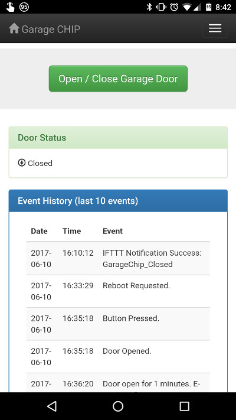
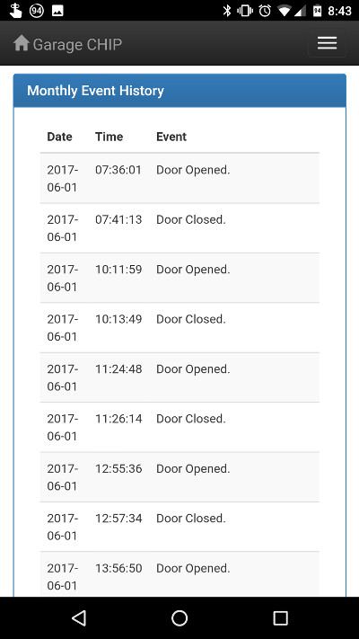
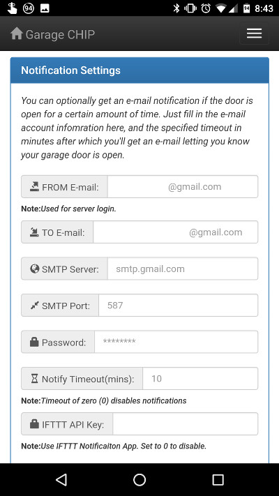
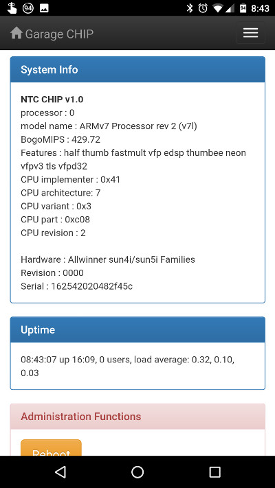
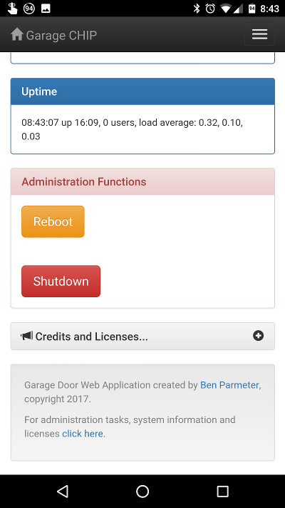

# Garage-CHIP

## CHIP based Garage Door Control / Status via Web Based Interface using Flask / Gunicorn / nginx
##### Also uses Bootstrap (http://getbootstrap.com/)

This project was inspired by Chris Driscoll's "Idiot's Guide to a Raspberry Pi Garage Door Opener" (http://www.driscocity.com/idiots-guide-to-a-raspberry-pi-garage-door-opener/).  I've replicated Chris' hardware setup almost exactly, save for the NTC CHIP (instead of the Raspberry Pi Model B).  

Instead of using the WebIO libraries that Chris uses, I decided to implement things a bit differently, providing a dynamic webUI with bootstrap and Flask.  

Initially this project used Flask's native WSGI services without Gunicorn or nginx as a proxy.  However, I noticed that after some time, the app would become unresponsive.  After a little research, it appears that Flask's built in web server is for testing purposes only and shouldn't really be used in production.  With that said, I'm using Gunicorn and nginx to proxy web resquests.  This is simple enough to configure and setup, however I had to redesign the application without the threading libraries, due to conflicts with Gunicorn.  Instead, I am using two processes running concurrently (control.py and app.py).  Control handles all of the RasPi GPIO interfaces, while App handles the web routes.  They communicate through a .dat file (using pickle to simplify the format).  

## Screenshots

## Hardware Configuration
See the parts list, hardware setup instructions here: [http://www.driscocity.com/idiots-guide-to-a-raspberry-pi-garage-door-opener/](http://www.driscocity.com/idiots-guide-to-a-raspberry-pi-garage-door-opener/)

### GPIO Mapping
CSID0 - Output Relay Control (Open / Close Garage Door)
CSID1 - Input for Magnetic Switch (Current State of Garage Door)
CSID2 - Output Relay Control Gate (Prevents spurious open/close events during power-on, shutdown and reboot cycles)

## Software Installation:
###NOTE: The install.sh script doesn't work properly.  Please follow the below instructions to install instead.

### Setup Wifi

>sudo ifconfig

Note the WLAN0 MAC address

>sudo nmtui

Select your network, password, activate

>sudo nano /etc/hostname

Replace Hostname with a unique hostname ('i.e. garage-chip')

Configure your router's DHCP server to recognize the hostname, mac address, and assign a unique IP address to the device

### CHIP No Limit Mode
If you're like me and want run your chip from a sufficiently powered wall wart, then you'll probably want to set No-Limit mode on your CHIP.  This allows more than 900mA to be drawn from the USB port, in case the device needs more power (which it probably will from time to time).  Normally this limit is in place to protect your host PC's USB port, but since we're using this port to power the CHIP from the wall outlet, it's OK to remove this limit.  Here's how you permanently remove the limit:

>sudo axp209 --no-limit
>sudo systemctl enable no-limit

### Install Locales and Set Timezone
>sudo apt-get update && sudo apt-get install locales && sudo dpkg-reconfigure locales && sudo locale-gen

You’ll get a large menu to select locales. Use the arrow keys to scroll down and spacebar to mark your location with an asterisk. It’s advised that you choose the location marked UTF8. Others are somewhat arcane edge cases! Hit return to continue.

>sudo dpkg-reconfigure tzdata

### Install Python PIP, Flask, Gunicorn, nginx
>sudo apt-get update

>sudo apt-get install python-pip nginx git gunicorn -y

>cd ~

>git clone https://github.com/nebhead/garage-chip

>sudo pip install flask

### Install CHIP IO

> sudo apt-get update
> sudo apt-get install git build-essential python-dev python-pip flex bison chip-dt-overlays -y
> git clone git://github.com/xtacocorex/CHIP_IO.git
> cd CHIP_IO
> sudo python setup.py install
> cd ..

### Setup nginx to proxy to gunicorn
>sudo rm /etc/nginx/sites-enabled/default # Delete default configuration

>sudo cp garage-chip.nginx /etc/nginx/sites-available/garage-chip # Copy configuration file to nginx

>sudo ln -s /etc/nginx/sites-available/garage-chip /etc/nginx/sites-enabled # Create link in sites-enabled

>sudo service nginx restart # Restart nginx

### Configure Crontab for boot
>sudo crontab -l > mycron

>echo "@reboot cd /home/chip/garage-chip && sudo sh boot.sh &" >> mycron

>echo "0 0 1 * * cd /home/chip/garage-chip/logs && sh backup.sh" >> mycron

>sudo crontab mycron

>rm mycron

## Using GarageChip
Setup the GarageChip options in the admin menu.  

### Set up e-mail notifications
TBD

### Set IFTTT notifications
If you are familiar with IFTTT then you can use this to setup an app notification on your smart phone.

Use the [Maker WebHooks applet](https://ifttt.com/maker_webhooks) to setup [notifications](https://ifttt.com/if_notifications).  

GarageChip uses the following event types:
* GarageChip_Open_Alarm
	* 'value1': minutes
* GarageChip_Closed
